# Synthetic Data Pipeline Agents

POC repo for a staged synthetic-data pipeline that creates benchmark cases with
strong role separation, deterministic routing, structured run logs, and offline
diversity/quality analysis.

The first shippable target is narrow on purpose:

- Generate one committed JSONL dataset of benchmark cases.
- Emit one structured Stage Run Log JSONL file per run.
- Compute offline diversity and quality-proxy metrics over the dataset and log.
- Preserve the core discipline: producers create, judges classify, the router
  owns state transitions.

## What This Is

This is a LangGraph-style pipeline with domain-agnostic agent roles and
domain-specific contracts. The current POC generates benchmark cases where:

```text
score X on benchmark B should be a strong proxy for ability Z in environment Y
```

Each committed case carries the benchmark prompt/setup, target ability,
environment assumptions, scoring contract, proxy claim, diagnostic pressure,
leakage risks, known limits, coverage tags, and controls.

The repo is organized around a router-owned stage graph:

```mermaid
flowchart LR
  START((START)) --> Design["Design<br/>Designer"]
  Design -->|"design batch"| DesignCheck["Batch design check<br/>deterministic"]
  DesignCheck -->|"accept"| SelectDesign["Select next design"]
  DesignCheck -->|"reject / retry"| Design
  SelectDesign -->|"design available"| DesignAudit["Design audit<br/>DesignAuditor"]
  SelectDesign -->|"queue empty"| Design
  DesignAudit -->|"accept"| Generate["Generate sample<br/>SampleGenerator"]
  DesignAudit -->|"reject design"| Drop["Archive rejection"]
  Generate -->|"accept"| DetVal["Deterministic validation"]
  Generate -->|"retry_*"| Generate
  DetVal -->|"accept"| QualityGate["Quality gate<br/>benchmark proxy"]
  DetVal -->|"reject / retry"| Generate
  QualityGate -->|"accept"| RubricGate["Rubric gate<br/>scoring reliability"]
  QualityGate -->|"reject / retry"| Generate
  RubricGate -->|"accept"| Curate["Curate corpus"]
  RubricGate -->|"reject / retry"| Generate
  Curate -->|"accept"| Commit["Commit sample"]
  Curate -->|"reject_duplicate"| Drop
  Commit -->|"target_n reached"| END((END))
  Commit -->|"more designs queued"| SelectDesign
  Commit -->|"need fresh design"| Design
  Drop -->|"continue if possible"| SelectDesign

  classDef startEnd fill:#0f766e,stroke:#0f766e,color:#ffffff,stroke-width:2px;
  classDef llm fill:#eff6ff,stroke:#2563eb,color:#0f172a,stroke-width:2px;
  classDef det fill:#f0fdf4,stroke:#16a34a,color:#0f172a,stroke-width:2px;
  classDef router fill:#fff7ed,stroke:#ea580c,color:#0f172a,stroke-width:2px;
  classDef artifact fill:#f8fafc,stroke:#64748b,color:#0f172a,stroke-width:2px;
  classDef reject fill:#fff1f2,stroke:#e11d48,color:#0f172a,stroke-width:2px;
  class START,END startEnd;
  class Design,DesignAudit,Generate,QualityGate,RubricGate llm;
  class DesignCheck,DetVal,Curate det;
  class SelectDesign router;
  class Commit artifact;
  class Drop reject;
```



See [docs/BENCHMARK_PROXY_PATCH_PLAN.md](docs/BENCHMARK_PROXY_PATCH_PLAN.md)
for the benchmark-proxy design notes and
[docs/PIPELINE_STATE_MACHINE.md](docs/PIPELINE_STATE_MACHINE.md) for the full
stage and route diagram.

## Core Principles

- Engineered diversity beats emergent diversity.
- Agents do not manage pipeline state.
- Judges never create, repair, or rewrite upstream artifacts.
- Route codes are fixed, inspectable, and used for routing.
- Stage Run Logs are first-class data, not incidental telemetry.
- Demo output must come from the pipeline path that will ship.

## Intended Repo Shape

```text
main.py                  # CLI entrypoint
pipeline.py              # Pipeline nodes, edges, retry policy
agents.py                # Agent role implementations
router.py                # Route table and context policies
rules.py                 # Deterministic benchmark schema and contract checks
models.py                # Pydantic artifact and event schemas
config.py                # CLI/env/domain config resolution
observability.py         # StageRecord JSONL writer
analyze.py               # Offline diversity and quality metrics

services/
  corpus_index.py        # Embeddings and nearest-neighbor novelty checks
  coverage_ledger.py     # Taxonomy-cell coverage counts
  validation_ledger.py   # Verdict trail
  rejection_archive.py   # Rejected artifacts and evidence

domains/
  benchmark_haiku.yaml   # POC benchmark domain contract

tests/
  test_router.py
  test_rules.py
  test_schemas.py
  test_pipeline_smoke.py
```

## Ship Gate

Before sending this repo out, the POC is not considered real unless these all
pass:

```bash
python3 -m venv .venv
source .venv/bin/activate
pip install -r requirements.txt
export OPENAI_API_KEY=...
# optional: export OPENAI_REASONING_EFFORT=medium
pytest
python3 main.py --domain domains/benchmark_haiku.yaml --target-stage benchmark --target-n 5 --seed 42 --run-id demo
python3 analyze.py --run-id demo
python3 run_report.py demo
python3 sample_outputs.py demo --limit 1
```

The demo must leave inspectable artifacts on disk:

```text
data/corpus/benchmark/demo.jsonl
logs/demo/stage_records.jsonl
logs/demo/validation.jsonl
logs/demo/rejections.jsonl
logs/demo/metrics.json
data/outputs/demo.jsonl
```

`main.py` refuses to reuse a run id when matching logs or corpus files already
exist. Use a new `--run-id`, or pass `--overwrite` when you intentionally want
to replace that run's artifacts.

No checked-in static demo output should be presented as a successful run. The
demo requires actual API credentials and must make live provider calls for the
LLM and embedding stages. Test doubles are allowed only inside tests.

## Agent Bundle

For benchmark runners that mount the pipeline into existing task images, build a
PyInstaller bundle:

```bash
scripts/build_agent_bundle.sh
```

The script auto-selects `python3.12`, `python3.11`, or `python3.10` when
available. You can override it with `PYTHON_BIN=/path/to/python3.10`.

The script creates `dist/synth-pipeline-bundle/`, including a runnable entrypoint
and the checked-in domain contracts:

```bash
dist/synth-pipeline-bundle/bin/synth-pipeline/synth-pipeline \
  --domain dist/synth-pipeline-bundle/share/domains/benchmark_haiku.yaml \
  --target-n 1 \
  --run-id smoke
```

The bundle carries its own Python runtime and pinned dependencies, so the task
image does not need `python3` installed just to launch the pipeline. It still
must be compatible with the platform the bundle was built for, and any external
tools or credentials the pipeline uses must be available at runtime.

## Environment

The live POC uses real provider calls for LLM and embedding stages. You can put
credentials in `.env` at the repo root:

```text
OPENAI_API_KEY=sk-...
```

See `.env.example` for optional model and base URL overrides. Values already
exported in your shell take precedence over `.env`.

The deterministic tests run without provider credentials. The smoke demo may
use a tiny target count, but it exercises the same node, route, logging, and
artifact paths as the full run.
