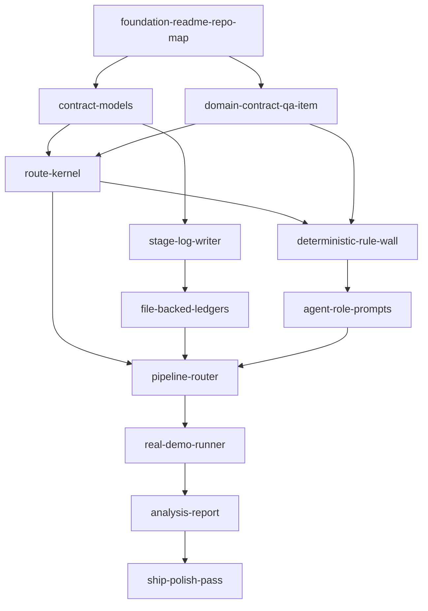
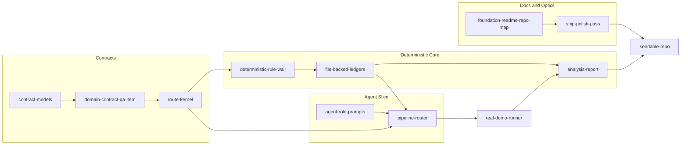

# POC Ship DAG

This DAG is optimized for shipping a credible POC today. It favors optics that
matter asymmetrically: clean repo shape, sharp names, one-command setup, a real
demo, and no fuzzy boundaries between agents, stages, routes, and artifacts.

## Critical Path



## Parallel Workstreams



## DAG Nodes

### `foundation-readme-repo-map`

**Purpose:** Make the repo understandable in 30 seconds.

**Outputs:**

- `README.md` with the goal, graph, ship gate, setup, and artifact contract.
- Top-level file/directory names aligned to the plan.
- Clear split between current plan, implementation, generated logs, and data.

**Acceptance:**

- A new reader can answer: what does this pipeline emit, how do I run it, where
  do artifacts land, and what proves the demo is real?

### `contract-models`

**Purpose:** Create the stable artifact language for every stage.

**Owns:**

- `models.py`
- `tests/test_schemas.py`

**Named models:**

- `SeedSpec`
- `PlanVerdict`
- `CandidateSample`
- `SampleVerdict`
- `CertifiedSample`
- `CommittedSample`
- `StageRecord`
- `RoutingDecision`

**Acceptance:**

- Pydantic round-trip tests pass.
- Every artifact has `id`, `content_hash`, and upstream provenance where
  applicable.
- No stage-specific free-form routing fields exist.

### `domain-contract-qa-item`

**Purpose:** Define the POC 1 domain without baking domain behavior into roles.

**Owns:**

- `domains/qa_item.yaml`
- relevant schema fixtures in `tests/fixtures/`

**Must define:**

- Inner input schema: `question`, `claimed_answer`, optional `context`.
- Taxonomy: `failure_mode`, `difficulty`, `scenario`.
- Route allowlist.
- Descriptive subcodes.
- Deterministic rule set.
- Semantic rule criteria.
- Novelty threshold placeholder.

**Acceptance:**

- Domain YAML loads through `config.py`.
- Route codes and subcodes are closed per run.
- Subcodes describe failures; they do not prescribe fixes.

### `route-kernel`

**Purpose:** Centralize all state transitions.

**Owns:**

- `router.py`
- `tests/test_router.py`

**Route names:**

- `accept`
- `reject_criteria_mismatch`
- `reject_schema`
- `reject_leakage`
- `reject_duplicate`
- `reject_coverage_mismatch`
- `reject_semantic_mismatch`
- `reject_upstream_invariant`
- `retry_infra`
- `retry_parse`
- `retry_provider_empty`
- `drop_retry_exhausted`
- `drop_timeout`
- `drop_policy_ceiling`

**Acceptance:**

- Router returns `RoutingDecision` for every allowed stage/verdict pair.
- Retry ceilings match `PLAN.md`.
- Producer retries receive criteria plus route code only, never judge prose.

### `stage-log-writer`

**Purpose:** Make observability a product artifact.

**Owns:**

- `observability.py`
- `logs/<run_id>/stage_records.jsonl`

**Acceptance:**

- Every stage invocation writes one `StageRecord`.
- Records include model/provider, prompt hash, criteria hash, route code,
  context policy, retry index, latency, and cost fields.
- Tests can write records to a temp run directory.

### `deterministic-rule-wall`

**Purpose:** Enforce the non-negotiable checks without LLM calls.

**Owns:**

- `rules.py`
- `tests/test_rules.py`

**Checks:**

- JSON schema validity.
- Label leakage.
- Empty context citation.
- Length bounds.
- Taxonomy cell consistency.

**Acceptance:**

- Each deterministic failure maps to a fixed route code and descriptive
  subcode.
- Deterministic judges return verdicts only; they do not rewrite artifacts.

### `file-backed-ledgers`

**Purpose:** Keep POC state inspectable.

**Owns:**

- `services/coverage_ledger.py`
- `services/validation_ledger.py`
- `services/rejection_archive.py`
- `services/corpus_index.py`

**Acceptance:**

- Coverage ledger reads/writes JSON.
- Validation and rejection ledgers append JSONL.
- Corpus index can answer "is this sample novel enough?" using embeddings when
  configured.
- Rejected artifacts do not enter novelty memory in POC 1.

### `agent-role-prompts`

**Purpose:** Make agent boundaries legible and hard to violate.

**Owns:**

- `agents.py`
- prompt text/constants co-located with each role

**Agent names:**

- `Strategist`
- `PlanAuditor`
- `SampleGenerator`
- `SemanticValidator`

**Acceptance:**

- Each agent has a bounded input contract and output schema.
- Judges receive artifact plus criteria only.
- Producer prompts never mention downstream pipeline completion.
- No agent owns routing or retry decisions.

### `pipeline-router`

**Purpose:** Wire stages into the actual executable graph.

**Owns:**

- `pipeline.py`
- `main.py`
- `tests/test_pipeline_smoke.py`

**Node names:**

- `plan_strategy_batch`
- `audit_seed_plan`
- `generate_candidate_sample`
- `validate_candidate_deterministically`
- `validate_candidate_semantically`
- `curate_committed_sample`
- `record_terminal_drop`

**Acceptance:**

- `--target-n 5` reaches committed samples or documented terminal drops.
- Stage retries honor the route table.
- Logs and data paths are deterministic from `run_id`.

### `real-demo-runner`

**Purpose:** Produce the demo that proves the POC is not handwaved.

**Owns:**

- CLI defaults in `main.py`
- demo instructions in `README.md`

**Demo command:**

```bash
python main.py --domain domains/qa_item.yaml --target-stage validator --target-n 5 --seed 42 --run-id demo
```

**Acceptance:**

- The command exercises the real pipeline graph.
- It emits committed samples and Stage Run Logs to disk.
- It uses live provider calls for LLM/embedding stages unless an explicitly
  named test fixture mode is used only inside tests. The public demo requires
  actual API credentials and live provider calls.
- The demo does not rely on checked-in generated output.

### `analysis-report`

**Purpose:** Turn logs into the eyeballing surface and quality proxy.

**Owns:**

- `analyze.py`
- `logs/<run_id>/metrics.json`

**Metrics:**

- Coverage entropy by taxonomy cell.
- Route-code distribution.
- Deterministic pass rate.
- Semantic pass rate.
- Curator accept rate.
- Near-duplicate rate.
- Pairwise-distance summary when embeddings are available.

**Acceptance:**

- Analysis reads only committed data and logs.
- No metrics are fed back into the in-loop agents during the same run.
- `python analyze.py --run-id demo` prints a concise human summary and writes
  `metrics.json`.

### `ship-polish-pass`

**Purpose:** Make the repo feel intentional before it leaves the building.

**Owns:**

- Final README tightening.
- Consistent names across docs, CLI, modules, tests, logs, and route codes.
- Removal of stale placeholders.
- One clean terminal transcript for setup, test, demo, analyze.

**Acceptance:**

- A reviewer sees one story: plan, graph, demo, artifacts, tests.
- There are no "TODO: implement" claims on the happy path.
- Any not-yet-built scope is explicitly labeled outside the POC.

## Minimum Division Of Labor

| Track | Primary nodes | Can start after |
|---|---|---|
| Contracts | `contract-models`, `domain-contract-qa-item` | now |
| Router | `route-kernel`, `pipeline-router` | `contract-models` |
| Deterministic core | `deterministic-rule-wall`, `file-backed-ledgers` | `domain-contract-qa-item` |
| Agents | `agent-role-prompts` | `contract-models`, `domain-contract-qa-item` |
| Demo | `real-demo-runner`, `analysis-report` | router + rules + agents |
| Optics | `foundation-readme-repo-map`, `ship-polish-pass` | now, then final pass |

## Non-Negotiable Demo Rule

The demo is valid only if it runs the same code path as the product POC:

```text
domain contract -> strategy -> plan audit -> generation -> validation -> curation -> analysis
```

Test fixture mode is allowed for unit tests only. It must be named as a fixture
mode, fenced to tests, and never presented as the product demo.
